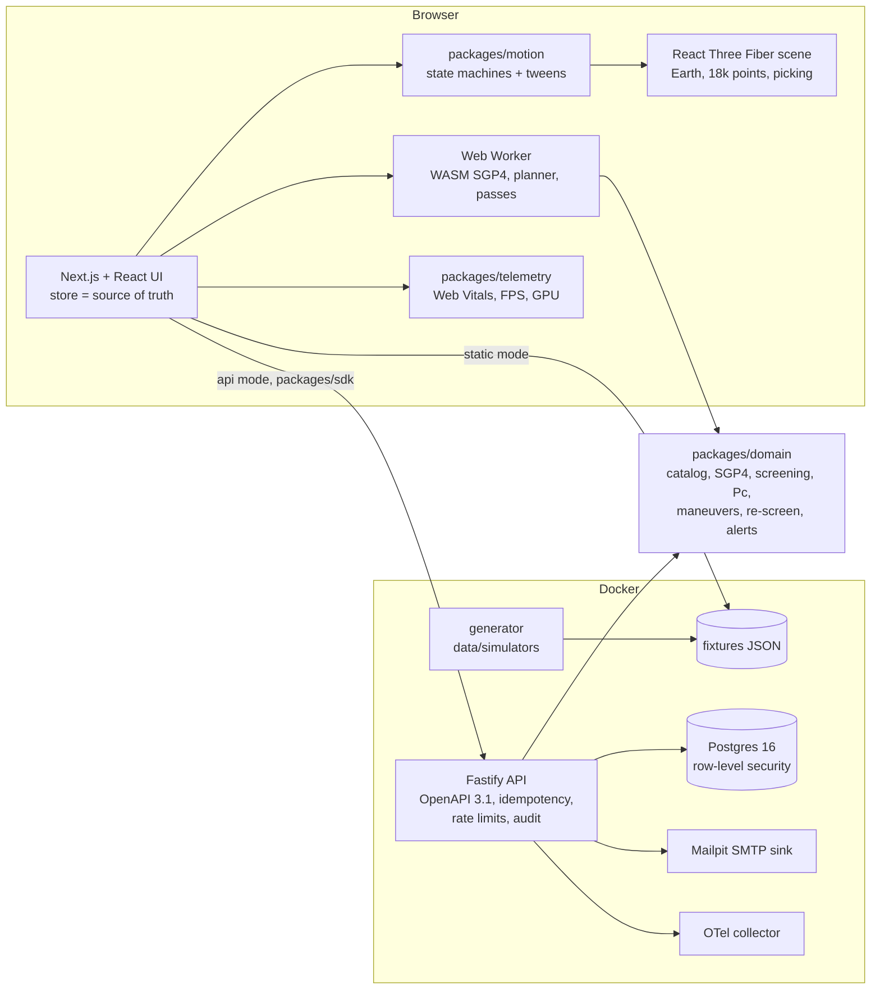

# ORBITAL: space traffic and collision intelligence

A space-traffic sandbox where the public site is the product. Scrolling falls from deep space onto a live globe of 18,050
catalogued objects, all propagated with SGP4 in the browser. The story then hands over to an operator's workspace. There you can
scrub 24 hours, fly into a satellite's orbital plane, open a high-risk conjunction, watch the encounter with its uncertainty,
plan two avoidance burns, and save an alert rule. Every burn is re-screened against the whole catalog before it is offered.

Built from blueprint 01 of the *Motion-First Interactive Product Engineering Build Book (Volume V)* as a **vertical slice**:
the demo scenario is built end to end on the book's stack. The parts that are not built are listed under
[Not built, and why](#not-built-and-why).

**Every object, operator, orbit, covariance and conjunction is generated by this repository. Nothing is a real satellite,
a real catalog number or a real operator.** The only external data are the SGP4 verification vectors published with
Vallado et al. (AIAA 2006-6753), used as golden tests.

- Live sandbox (static, runs entirely in your browser): https://mrrishit909.github.io/projects/orbital-space-traffic/demo/
- 2 min 15 s captioned recording of the whole scenario: [`docs/video/demo.mp4`](docs/video/demo.mp4)
- Case study: https://mrrishit909.github.io/projects/orbital-space-traffic/

## Run it

```bash
docker compose up --build -d --wait     # web :8431, API :8430, Postgres :55430, mail sink :8432, OTel collector, generator
make test                               # 72 unit + API contract tests in Docker against a throwaway Postgres (about 45 s)
make e2e                                # 7 Playwright journeys against the static export (needs Google Chrome)
make load-test                          # HTTP concurrency + 10,000 WebSocket subscriptions against a running API
make seed | make reset | make record    # regenerate data / wipe and reseed / re-record the demo video
```

Open http://localhost:8431. This is the same site as the public sandbox, but built to call the API. Alerts you save there arrive
as e-mails at http://localhost:8432. The demo tokens are for local use only: `aurora-operator-demo`, `aurora-viewer-demo` and
`lattice-operator-demo` (a second operator, used to test tenant isolation). The static sandbox needs no backend:
`npm ci && node data/simulators/generate.ts && npm run build -w @orbital/web && node scripts/serve.ts`.

## The demo, step by step (blueprint section 17)

1. **Deep space.** The page opens 340,000 km out. Four scroll chapters move the camera to Earth. The globe is lit by the Sun at
   the scene's time and turns with sidereal time. Objects appear by altitude: 16,814 in low Earth orbit, then 596 in medium and
   highly elliptical orbits, then 640 near geostationary altitude. Last, everything except the demo operator's 60 satellites dims.
2. **Scrub 24 hours.** Playback runs at 1× to 600×. The worker propagates the whole catalog with WASM SGP4 at two times per
   request, and the GPU interpolates between them (cubic Hermite in the vertex shader). Scrubbing jumps to any second of the
   window.
3. **Fly to a satellite.** Selecting AURORA-205 (by clicking the globe, which uses GPU picking, or by search) flies the camera
   down the orbit normal. The camera keeps north up and takes the short way round. The inspector shows the orbit, the
   satellite's conjunctions and its ground-station passes, found by bisection to 0.5 s.
4. **High-risk conjunction.** AURORA-205 against a rocket body: closest approach 41 m at 09:21:00 UTC (7 h 21 min after "now"),
   relative speed 5.85 km/s. The combined 1σ in the encounter plane is 545 × 88 m, the hard-body radius is 5.4 m, and
   **Pc = 3.0 × 10⁻⁴**. A Monte Carlo check of the same integral gives 3.15 × 10⁻⁴.
5. **Encounter with uncertainty.** A frame centred on the satellite and drawn in metres. It shows the rocket body's straight
   relative path, the 1σ and 3σ ellipses in the encounter plane, the 1σ ellipsoid in 3D, and the hard-body circle at true size.
   Playback runs at 0.2× real time and holds at closest approach.
6. **Two avoidance maneuvers.** The planner searches 7 lead times × 2 directions, with bisection on the burn size, for the
   smallest in-track burn that brings Pc to 1 × 10⁻⁶. Then it **re-screens every candidate's new orbit**. The cheapest burns were
   rejected: 2.84 cm/s four orbits early clears this conjunction but moves the 07:45 pass with the same rocket body to 134 m
   (Pc 3.0 × 10⁻⁴). 8 of the 10 candidates checked failed this way. The two offered options are:

   | | Option A | Option B |
   |---|---|---|
   | Burn | 08:33 UTC, 0.5 orbits early | 08:57 UTC, 0.25 orbits early |
   | Δv (retrograde) | 7.65 cm/s | 16.26 cm/s |
   | Propellant (300 kg, Isp 220 s) | 10.6 g | 22.6 g |
   | New miss / Pc | 707 m / 1.0 × 10⁻⁶ | 328 m / 1.0 × 10⁻⁶ |
   | Worst new approach, rest of window | 3.40 km (Pc 1.4 × 10⁻¹⁴) | 612 m (Pc 7.1 × 10⁻¹⁷) |

7. **Alert rule.** "Pc ≥ 1 × 10⁻⁴ on my fleet within 24 h" matches this one conjunction. In the static sandbox the e-mail is
   simulated. In Docker it is sent over SMTP to Mailpit and recorded in `alert_deliveries` and the audit log.

The URL tracks the state: for example `?cj=d9bb6a9c&mode=plan&opt=a&t=2026-10-06T09:20:00Z` reopens the plan with option A
chosen.

## Architecture



| Piece | What it does |
|---|---|
| `packages/domain` | All the orbital logic, shared by the browser worker and the API. **Catalog**: seeded generator with constellations, sun-synchronous shells, three fragmentation clouds, scattered debris, rocket bodies, navigation, geostationary and Molniya-like orbits. TLE lines are formatted to the column spec with checksums. **Planted encounters**: Newton iteration on a secondary's TLE (mean anomaly, RAAN, mean motion) so that SGP4 puts it at a chosen offset from the primary at a chosen time. **Screening**: perigee/apogee shell filter, then a 60 s pass using straight-line relative motion to find the sample nearest each approach, then Brent's method on the exact SGP4 distance. **Pc**: 2D encounter-plane integral (Gauss–Legendre on the hard-body disc) of the combined covariance; synthetic covariance grows with element age. **Maneuvers**: two-body + J2 RK4 propagation of the burned-minus-unburned offset added to the SGP4 path; grid over lead time × direction, bisection on size. **Re-screen**: the nominal orbit is screened once with a 60 km volume, then each candidate re-checks only those passes. It falls back to a full screen if the burn moves the orbit more than 54 km. |
| `packages/motion` | Deterministic state machines (`transition`, `replay`) and an orchestrator that tweens values on an explicit clock. Business state never lives here. Reduced motion sets every duration to 0, and pause freezes tweens. |
| `packages/telemetry` | LCP/INP/CLS (web-vitals), FPS and p95 frame time, dropped frames, long tasks, GPU context loss, scene-load and shader-compile time, renderer counters. Generates a W3C `traceparent` for each API call. In API mode it beacons samples to `/v1/telemetry`. |
| `apps/web` | Next.js 16 static export. Intro chapters scroll over the persistent canvas, and the sandbox panels share the same scene. The worker uses satellite.js's WASM bulk SGP4 (JS fallback). Includes a command palette, keyboard shortcuts, deep links, list/table view, aria-live announcements, a failure lab (feed outage, GPU context loss, 50,000-object stress) and a telemetry HUD. |
| `apps/api` | One Fastify process implementing the blueprint's contract. Every request gets a bearer-token tenant + role, a token-bucket rate limit with `RateLimit-*` headers, and structured `{error:{code,message,traceId}}` errors. Mutations take an `Idempotency-Key` (same key and body replays, different body returns 409). There is a hash-chained audit log, `/metrics` with p50/p95/p99 per route, OpenTelemetry HTTP and Postgres spans, and a WebSocket feed of live positions. |
| `packages/sdk` | Typed client: bearer token, traceparent, idempotency keys, cursor pagination, `ApiError`. |
| Postgres | Tables from section 5 (`organizations`, `space_objects`, `tle_sets`, `ephemeris_points`, `conjunction_events`, `maneuvers`), plus tenant_id / created_by / updated_at / deleted_at where rows belong to an operator. Alert rules, deliveries, idempotency keys, audit and client telemetry are additions. The API connects as `orbital_app` under row-level security; the owner runs migrations. |

## Motion system (sections 3, 9, 15)

- **Motion follows state.** The store holds what is selected, the time, the open conjunction and the plan. The journey machine
  (`apps/web/src/journey.ts`) decides which view follows an event. The scene derives camera and layer targets from the view and
  tweens toward them. No product decision waits on an animation callback.
- **Physical motion is physical.** Objects move on their SGP4 trajectories with true periods, and the selected orbit's trail is
  one real period. The terminator is the Sun's direction at the scene's time. Stars are three shells at different distances,
  giving parallax and no other motion. Distant points fade (depth fog); nothing pulses for decoration.
- **Reduced motion** (OS setting, the toggle, or `?rm=1`): camera flights and chapter transitions become instant, encounter
  playback is replaced by the closest-approach state, and all information stays. An e2e test runs the whole flow this way.
- **Pause** stops time and all tweens. **List view** replaces the canvas with tables of every conjunction and object, and is
  also the fallback when there is no WebGL or the GPU context is lost.
- **Keyboard:** ⌘K / `/` search, Space play, ← → scrub, `[` `]` conjunctions, L list, M reduced motion, P pause, Esc back,
  Alt + arrows to turn the globe.

## What the tests check

| Test | Result |
|---|---|
| SGP4 against the 33 AIAA 2006-6753 cases (`java_sgp4_ver.out`) | all within 1 m and 3 mm/s. Case 33334, the paper's deliberate bad-mean-motion case, is refused as it should be. The Fortran and Matlab files in the same archive differ from the Java and C++ lineage by 960 m on object 23599 (the documented Lyddane fix), so the Java file is the reference. |
| Screening precision/recall vs a brute-force reference (5 s steps, no shell filter, 8 primaries × 400+ objects) | 1.0 / 1.0 |
| Encounter-plane Pc vs 4,000,000-sample Monte Carlo, 4 geometries, plus the closed form for a centred circular Gaussian | within 4 standard errors / to 1e-9 |
| Planned options | meet Pc ≤ 1e-6; a 3% smaller burn does not; the fast re-screen gives the same options and rejections as the full re-screen |
| Property tests | Hermite interpolation (exact on straight lines, hits endpoints), unit round trips, RK4 energy drift < 0.2% over a day |
| Coverage (domain + motion) | 98% statements, 100% lines (threshold 85%) |
| API (14 tests, every body validated against the published OpenAPI 3.1) | pagination, bbox, ephemeris limits, authz matrix (no token / unknown / viewer / operator), tenant escape (other operator gets 404 on Aurora's ids and prefixes; RLS blocks a WHERE-less query and a cross-tenant insert), idempotency replay and 409, audit chain verified, 503 feed outage, trace propagation, 429 with headers, WebSocket stream |
| Playwright (7 journeys) | the section 17 walk with deep-link restore; reduced motion; keyboard only; feed outage and recovery; GPU context loss and recovery; 50,000-object stress; visual baselines of three motion states (shell reveal, encounter at TCA, plan view) |

## Performance and observability

- **Browser, real GPU** (Chrome on Apple silicon, headless with Metal, recorded during the demo): 60 FPS, p95 frame 17.7 ms,
  7 draw calls, 18,050 points, shader compile 2 ms, LCP 60 ms on localhost, INP 168 ms.
- **Browser, 50,000 objects, software GL** (SwiftShader in the e2e test): 15 FPS, 6 draw calls, 53,300 points. This is a floor,
  not a GPU figure (`docs/performance-e2e.json`). About 1.5 MB of JavaScript (uncompressed) and 3.8 MB of catalog JSON.
- **Screening** (Node, WASM SGP4): 60 satellites × 18,050 objects × 24 h in 9.4 s; 3.06 M pairs in range checked, 251 refined.
  Planning with re-screen: 5.0 s (it was 48 s before the near-pass list).
- **API load** (same machine, `docs/load-test.json`): 32 clients for 10 s gave 5,911 req/s, p50 4.2 ms, p95 10.8 ms, p99 13 ms,
  0 errors. 10,000 WebSocket subscriptions opened in 0.95 s and received 9,918 position messages a second (one each per second).
- Traces: the browser sends `traceparent`; the API logs the trace id in every structured log line, returns it in error bodies,
  and exports HTTP and Postgres spans to the collector (`docker compose logs otel`).

## Tradeoffs

- **One API process instead of ten services.** The blueprint lists gateway, catalog, ephemeris, propagation, conjunction,
  maneuver, alert, identity, billing and render-data services. They share one domain package and would split along the route
  groups. The book itself warns against services that wrap one table, and here every one of them would.
- **Domain logic in TypeScript, shared by worker and API.** The same planner runs in the browser (instant previews, no backend
  for the public demo) and on the server (persisted, audited). The cost is no Python orbital tooling.
- **Conjunctions are precomputed; previews are live.** A full screen of the fleet takes 9 s, so it runs when data is generated, as
  an operator's screening service would. Planning, re-screening, passes and propagation run on demand.
- **Short-encounter Pc.** At 0.4–15 km/s relative speed the encounter-plane assumption holds for most events. The slowest one
  (0.43 km/s) is where it is weakest; long-encounter Pc is not built.
- **Synthetic covariance.** Realistic magnitudes by object class, growing with element age, but not estimated from tracking
  residuals. Pc values are therefore only as meaningful as that assumption.

## Not built, and why

- Real catalog data (CelesTrak/Space-Track): the book requires demo mode on redistributable fixtures, and real element sets
  would make every conjunction here look like a claim about real satellites.
- Microservice split, Kafka/Redpanda, Redis, MinIO/S3 and PostGIS: nothing in this slice needs ordering/replay, a shared cache,
  large artifacts or spatial SQL (orbits are not geometries). See the first tradeoff.
- Terraform, Kubernetes, AWS, canary/blue-green, signed images, SBOM: there is no cloud account here. The public deployment is the
  static export on GitHub Pages. `.github/workflows/ci.yml` runs audit, type-check, unit + coverage and Playwright.
- OIDC/SAML, MFA, billing and plans: demo bearer tokens with roles stand in for identity.
- KTX2/Basis textures, glTF assets, WebGPU: the scene is points, lines and one textured sphere (2k and 1k JPEG levels of detail).
- Anomaly detection on orbital residuals, covariance-realism tests, Monte Carlo Pc for long encounters.
- Production-like load test across machines, chaos testing of the database, SLO burn-rate alerting.

## Layout

```
apps/web          Next.js site (intro + sandbox), scene, worker, UI
apps/api          Fastify API, migrations, seed
packages/domain   orbital logic + tests       packages/motion   state machines, tweens + tests
packages/telemetry  frontend telemetry        packages/sdk      typed API client
data/simulators   generator                   data/fixtures     generated data, provenance, SGP4 vectors
tests/e2e         Playwright                  tests/performance load test
infra             Dockerfiles, nginx (CSP), OTel collector      docs  OpenAPI, load and perf results, video
```
